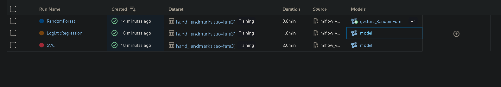
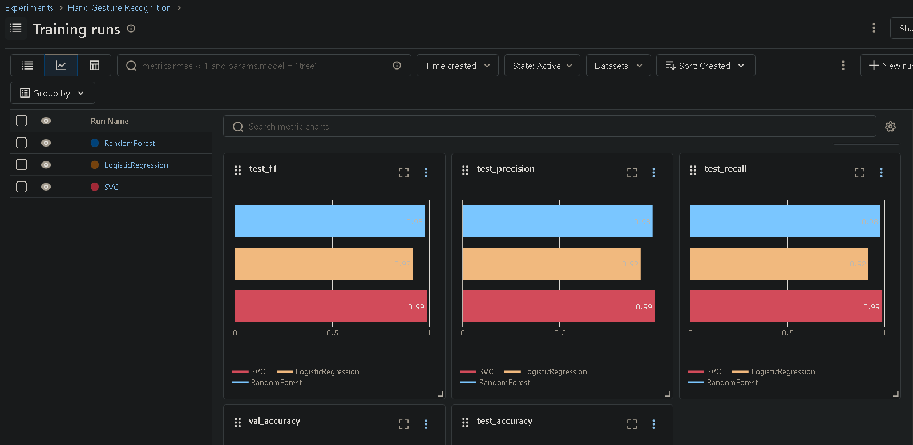
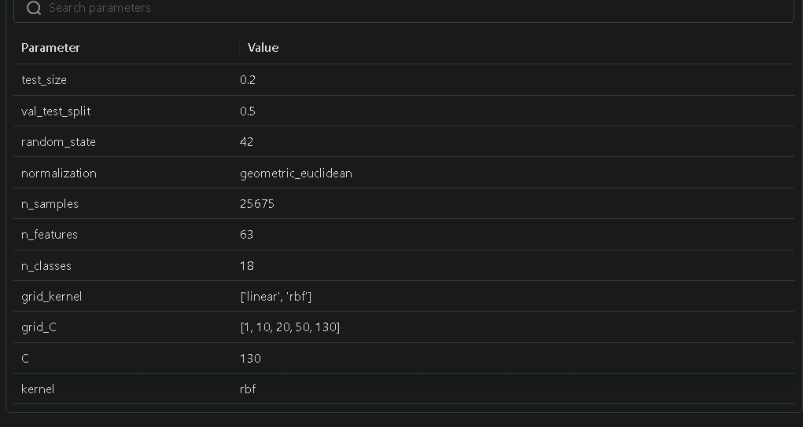
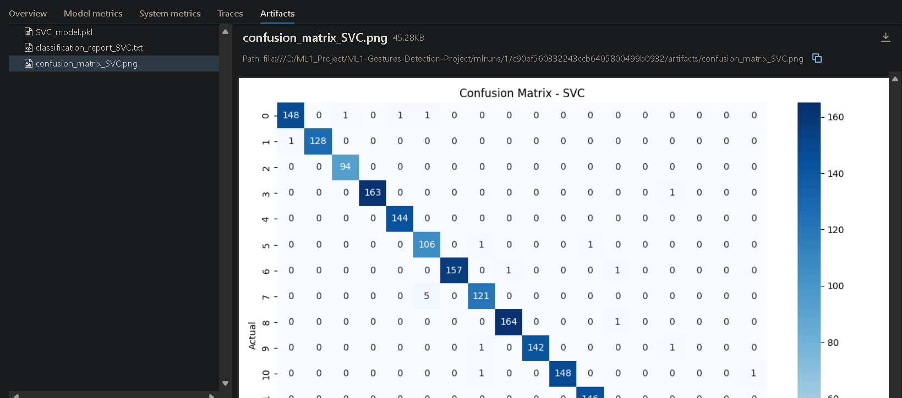
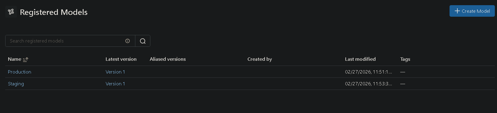

# Hand Gesture Recognition 🤚

A machine learning project that classifies 18 hand gestures in real-time using MediaPipe hand landmarks extracted from the HaGRID dataset.


## Project Structure
```
ML1-Gestures-Detection-Project/
│
├── data/
│   └── hand_landmarks.csv          # HaGRID landmarks extracted via MediaPipe
│
├── models/
│   ├── SVC_model.pkl
│   ├── LogisticRegression_model.pkl
│   └── RandomForest_model.pkl
│(they appear after running)
├── videos/
│   └── output_video.mp4            # Real-time demo recording
│
├── notebook.ipynb                  # Full EDA, training, and evaluation notebook
├── mlflow_version.py                        # Training pipeline with MLFlow logging
├── video.py                        # Real-time webcam gesture recognition
├── requirements.txt
└── README.md
```

## Dataset
[HaGRID](https://github.com/hukenovs/hagrid) — Hand Gesture Recognition Image Dataset.
- 18 gesture classes
- 21 hand landmarks (x, y, z) per sample extracted using MediaPipe
- ~25,000 samples

## Gesture Classes
| | | |
|---|---|---|
| call | dislike | fist |
| four | like | mute |
| ok | one | palm |
| peace | peace_inverted | rock |
| stop | stop_inverted | three |
| three2 | two_up | two_up_inverted |

## Preprocessing
1. **Recentering** — subtract wrist landmark (index 0) from all (x, y) coordinates → wrist becomes origin (0, 0)
2. **Scaling** — divide all (x, y) by Euclidean distance from wrist to middle fingertip (index 12) → removes hand size and distance variation
3. Z coordinates left untouched (already normalized by MediaPipe)
4. Feature order matches training: `x1 y1 z1 x2 y2 z2 ... x21 y21 z21`

## Models & Hyperparameter Tuning
All models tuned using GridSearchCV with holdout validation (PredefinedSplit — no cross validation).

| Model | Tuned Parameters |
|---|---|
| SVC | kernel: [linear, rbf], C: [1, 10, 20, 50, 130] |
| Logistic Regression | C: [0.01, 0.1, 1, 10, 100] |
| Random Forest | n_estimators: [50, 100, 200], max_depth: [None, 10, 20] |


## MLFlow Experiment Tracking
All runs logged with MLFlow — metrics, parameters, confusion matrices, classification reports, and models.
```bash
mlflow ui
```
Then open `http://localhost:5000`
### 1. Model Runs


### 2. Models Comparison


### 3. Logged Parameters Example


### 4. Model Artifacts


### 5. Registered Models — Production & Staging


## Installation
```bash
conda create -n gesture_env python=3.10
conda activate gesture_env
pip install -r requirements.txt
```

## Usage

**Train models:**
```bash
python train.py
```

**Real-time webcam demo:**
```bash
python video.py
```
Press `q` to stop recording.

## Tech Stack
- **MediaPipe** — hand landmark extraction
- **scikit-learn** — model training and evaluation
- **MLFlow** — experiment tracking and model registry
- **OpenCV** — webcam video processing
- **pandas / numpy** — data processing
- **Matplotlib/Seaborn** - Data Viz